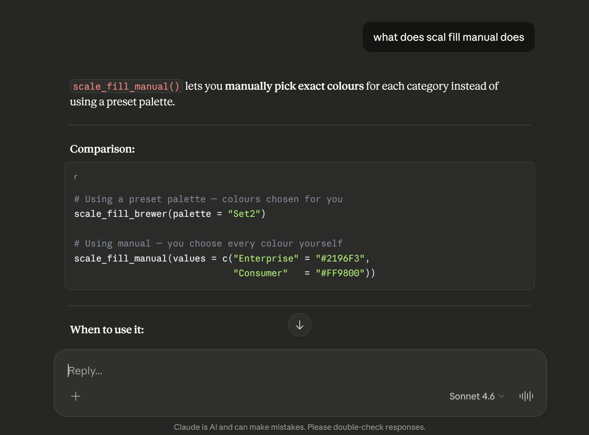
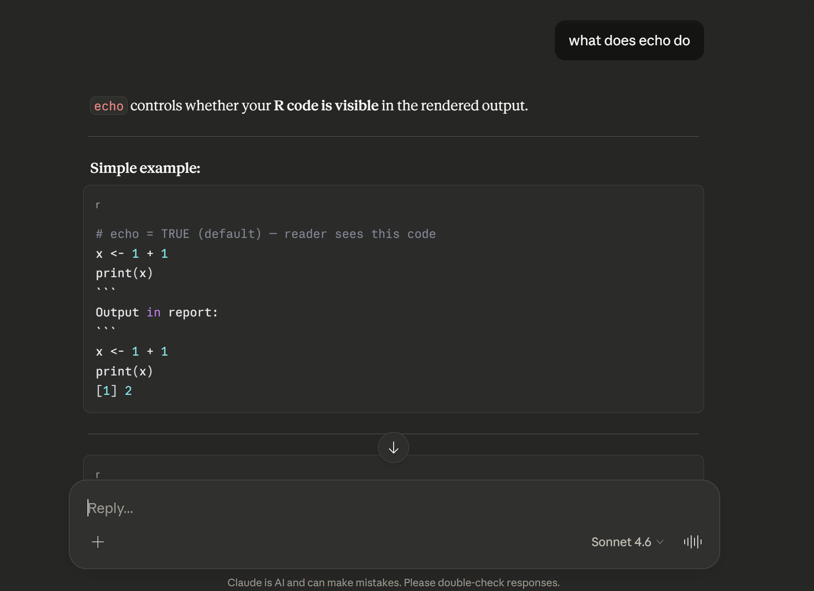
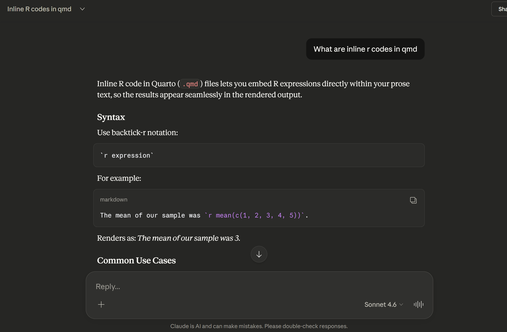
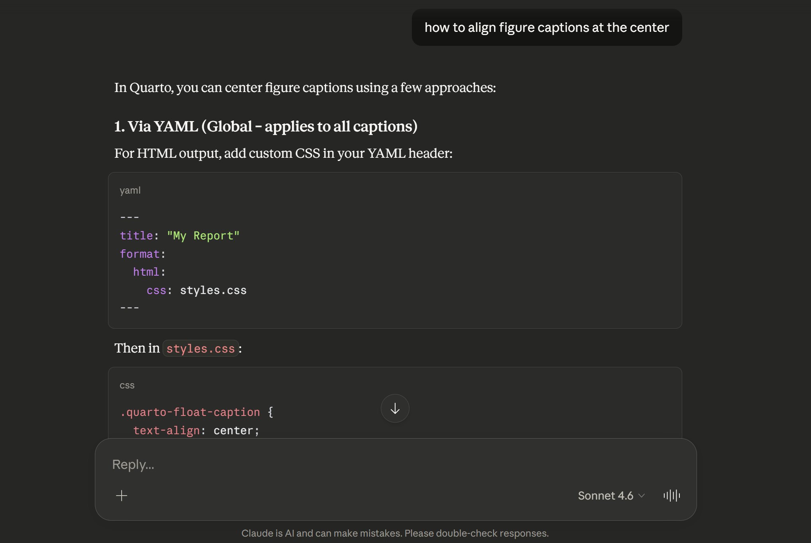

```{r}
#| echo = FALSE
knitr::opts_chunk$set(
        echo = FALSE,
        warning = FALSE,
        error = FALSE
)
```

# AI referencing

1. Used Google for ROI (Return on Investment) formula.

2. Did some brainstorming for cross referencing with Claude AI

```{r}




```


3. Used R documentation for syntax and other useful insights.


:::{.callout-note}
Used Lecture notes for most of information.
:::
